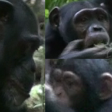

# Individual Animal Re-ID Datasets
> [!NOTE]  
> Citations go a long way — give credit where it’s due! <br/><br/>
<!--
 Scroll down the page to find out how to cite the tables if you re-use them in any form or way-->

<br/><br/>
### Table 1: A collection of publicly available computer vision datasets for the re-identification of individual animals
Arranged by date of publicatipn. An asterisk (*) marks data derived from video footage. "n.a." indicates that a corresponding publication could not be found. The number of individuals present in each dataset is listed under "IDs". "Annot\." denotes the total number of annotated instances.

| **Year** | **Dataset** | **Publication** | **IDs** | **Species** | **Annot\.** | **Preview** |
|----------|-------------|-----------------|---------|-------------|-----------------|-------------|
| 2025     | [WildlifeReID-10k ](https://www.kaggle.com/datasets/wildlifedatasets/wildlifereid-10k/code) | <sub>[WildlifeReID-10k: Wildlife re-identification dataset with 10k individual animals](https://arxiv.org/abs/2406.09211) | 10772 | bird, cat, chicken, chimpanzee, cow, dog, dolphin, fish, giraffe, hyena, leopard, macaque, nyala, panda, polar bear, sea star, sea turtle, seal, tiger, whale, whaleshark, zebra | 140488 | species of 37 datasets from the [wildlife-datasets python library](https://github.com/WildlifeDatasets/wildlife-datasets)|
| 2025     | [CzechLynx](https://www.kaggle.com/datasets/18c74c4c3b0687891f0ae10673af68a3adef3d5a478bfc336aa75b7eb3a4e6a9) | <sub>[CzechLynx: A Dataset for Individual Identification and Pose Estimation of the Eurasian Lynx](https://doi.org/10.48550/arXiv.2506.04931)<sub> | 219 | Eurasian lynx | 37,400 real + 100k synthetic | |
| 2025     | [Cattle Face Dataset](https://pan.baidu.com/s/1wHKT-6R6B9OtxaYZ2N4MOw?pwd=6ckt) | <sub>[Enhanced multi-breed cattle face recognition in complex environments using attention-based deep learning](https://doi.org/10.1007/s00371-025-03910-z)<sub> | 1957| cattle\* (Simmental, Angus, Hereford, Limousin, Charolais, Piedmontese, Sanhe, Japanese Wagyu) | 14047 | |
| 2025     | [CoBRA re identidication youngstock](https://zenodo.org/records/15018518) | <sub>[Dynamic Multi-Behaviour, Orientation-Invariant Re-Identification of Holstein-Friesian Cattle](https://doi.org/10.3390/s25102971)<sub> | 48 | (red) Holstein-Friesian cattle\* | 11438 | |
| 2024     | [Chicks4FreeID](https://doi.org/10.57967/hf/2345) | <sub>[Towards Automated Chicken Monitoring: Dataset and Machine Learning Methods for Visual, Noninvasive Reidentification](https://doi.org/10.3390/ani15010001)<sub> | 50, <br>2, <br>2 | chicken, <br>duck, <br>rooster | 1215,<br> 40,<br> 15 | |
| 2024     | [SeaTurtleID2022](https://www.kaggle.com/datasets/wildlifedatasets/seaturtleid2022) | <sub>[SeaTurtleID2022: A long-span dataset for reliable sea turtle re-identification](https://doi.org/10.1109/WACV57701.2024.00699)<sub> | 438 | sea turtle | 8729 ||
| 2024     | [SheepDataset](https://pan.baidu.com/s/1EOIO4C4c1VxF5UIEaOXkrQ?pwd=13no) | <sub>[SheepNet: Rapid Sheep Face Recognition Based on Attention and Knowledge Distillation](https://doi.org/10.1007/978-981-97-8502-5_18)<sub> | 56 |  Small-tailed Han sheep\* | 5285 ||
| 2023     | [Mammal Club <br>\(IISD\)](https://github.com/WJ-0425/MammalClub) | <sub>[MammalClub: An Annotated Wild Mammal Dataset for Species Recognition, Individual Identification, and Behavior Recognition](https://doi.org/10.3390/electronics12214506)<sub> | 218 | 11 terrestrial mammal species\* | 33612 ||
| 2023     | [Multi\-pose <br>dog dataset](https://data.mendeley.com/datasets/v5j6m8dzhv/1) | <sub>[Animal Re-Identification Algorithm for Posture Diversity](https://doi.org/10.1109/ICASSP49357.2023.10094783)<sub> | 192 | dog | 1657 ||
| 2023     | [PolarBearVidID](https://doi.org/10.5281/zenodo.7564529) | <sub>[PolarBearVidID: A Video-Based Re-Identification Benchmark Dataset for Polar Bears](https://doi.org/10.3390/ani13050801)<sub> | 13 | polar bear\* | 138363 |                  |
| 2023     | [Sea Star Re\-ID](https://lila.science/sea-star-re-id-2023/) | <sub>[An open-source general purpose machine learning framework for individual animal re-identification using few-shot learning](https://doi.org/10.1111/2041-210X.14278)<sub> | 39, <br>56 | common starfish, <br>Australian cushion star | 1204, <br>983 ||
| 2022     | [Goat Image Dataset](https://dx.doi.org/10.17632/4skwhnrscr.2) | [Real-time goat face recognition using convolutional neural network](https://doi.org/10.1016/j.compag.2022.106730) | 10 | Saanen goat | 1311 ||
| 2022    | [Animal\-<br>Identification\-<br>from\-Video](https://github.com/LucyKuncheva/Animal-Identification-from-Video) | <sub>[A Benchmark Database for Animal Re-Identification and Tracking](https://doi.org/10.1109/IPAS55744.2022.10052988)<sub> | 58, <br>26, <br>9 | pigeon\*, <br>pig\*, <br>Koi fish\*  | 12671, <br>6184, <br>1635 |   |
| 2022     | [Beluga ID](https://lila.science/datasets/beluga-id-2022/) | n\.a\. | 788 | beluga whale | 5902 ||
| 2022     | [Happywhale](https://kaggle.com/competitions/happy-whale-and-dolphin) | n\.a\. | 15587 | 30 different species of whales and dolphins | 51033 ||
| 2022     | [Hyiena ID](https://lila.science/datasets/hyena-id-2022/) | n\.a\. | 256 | spotted hyena | 3129 ||
| 2022     | [Leopard ID](https://lila.science/datasets/leopard-id-2022/) | n\.a\. | 430 | African leopard | 6805 ||
| 2022     | [SealID](https://doi.org/10.23729/0f4a3296-3b10-40c8-9ad3-0cf00a5a4a53) | <sub>[SealID: Saimaa Ringed Seal Re-Identification Dataset](https://doi.org/10.3390/s22197602)<sub> | 57 | Saimaa ringed seal | 2080 |  |
| 2022     | [SeaTurtleIDHeads](https://www.kaggle.com/datasets/wildlifedatasets/seaturtleidheads) | <sub>[SeaTurtleID: A novel long-span dataset highlighting the importance of timestamps in wildlife re-identification](https://doi.org/10.48550/arXiv.2211.10307)<sub> | 400 | sea turtle | 7774 ||
| 2022     | [Turtle Recall](https://zindi.africa/competitions/turtle-recall-conservation-challenge/data) | n\.a\. | 100 | sea turtle | 2145 ||
| 2021     | [Cow Dataset](https://doi.org/10.6084/m9.figshare.16879780)  | <sub>[Individual dairy cow identification based on lightweight convolutional neural network](https://doi.org/10.1371/journal.pone.0260510)<sub> | 13 | cow | 3772 |  |
| 2021     | [Cows2021](https://doi.org/10.5523/bris.4vnrca7qw1642qlwxjadp87h7)  | <sub>[Towards Self-Supervision for Video Identification of Individual Holstein-Friesian Cattle: The Cows2021 Dataset](https://doi.org/10.48550/arXiv.2105.01938)<sub> | 182 | Holstein\-Friesian cattle\* | 13784 |  |
| 2021     | [Giraffe Dataset](https://plmlab.math.cnrs.fr/vmiele/animal-reid/) | <sub>[Revisiting animal photo-identification using deep metric learning and network analysis](https://doi.org/10.1111/2041-210X.13577)<sub> | 62 | giraffe | 624 ||
| 2021     | [iPanda\-50](https://github.com/iPandaDateset/iPanda-50)  | <sub>[Giant Panda Identification](https://doi.org/10.1109/TIP.2021.3055627)<sub> | 50 | giant panda | 6874 |  |
| 2021     | [300-Cattle-source](https://cloud.une.edu.au/index.php/s/eMwaHAPK08dCDru)  | <sub>[Automated Muzzle Detection and Biometric Identification via Few-Shot Deep Transfer Learning of Mixed Breed Cattle](https://doi.org/10.3390/agronomy11112365 )<sub> | 300 | Bos taurus beef cattle (including Angus, Hereford Charolais and Simmenta) | 2900 |  |
| 2020     | [AAU Zebrafish Dataset](https://www.kaggle.com/datasets/aalborguniversity/aau-zebrafish-reid) | <sub>[Re-Identification of Zebrafish using Metric Learning](https://doi.org/10.1109/WACVW50321.2020.9096922)<sub> | 6 | zebrafish\* | 6672 |  |
| 2020     | [Animal Face <br>Dataset](https://doi.org/10.17632/z3x59pv4bz.2) | <sub>[Automatic Identification of Individual Primates with Deep Learning Techniques](https://doi.org/10.1016/j.isci.2020.101412)<sub> | 1040 | 41 primate species | 102399 ||
| 2020     | [ATRW](https://lila.science/datasets/atrw) | <sub>[ATRW: A Benchmark for Amur Tiger Re-identification in the Wild](https://doi.org/10.1145/3394171.3413569)<sub> | 92 | Amur tiger\* | 3649 |   |
| 2020     | [Lion Face <br>Dataset](https://github.com/tvanzyl/wildlife_reidentification/) | <sub>[Automated Identification of Individuals in Wildlife Population Using Siamese Neural Networks](https://doi.org/10.1109/ISCMI51676.2020.9311574)<sub> | 94 | lion | 740 ||
| 2020     | [NDD20](https://doi.org/10.25405/data.ncl.c.4982342) | <sub>[NDD20: A large-scale few-shot dolphin dataset for coarse and fine-grained categorisation](https://doi.org/10.48550/arXiv.2005.13359)<sub> | 44, <br>82 | bottlenose and white\-beaked dolphin, <br>white\-beaked dolphin \(underwater\)\* | 2201, <br>2201 ||
| 2020     | [Nyala Data](https://github.com/tvanzyl/wildlife_reidentification/) | <sub>[Automated Identification of Individuals in Wildlife Population Using Siamese Neural Networks](https://doi.org/10.1109/ISCMI51676.2020.9311574)<sub> | 237 | nyala | 1942 ||
| 2020     | [OpenCows2020](https://doi.org/10.5523/bris.10m32xl88x2b61zlkkgz3fml17) | <sub>[Visual identification of individual Holstein-Friesian cattle via deep metric learning](https://doi.org/10.1016/j.compag.2021.106133)<sub> | 46 | Holstein\-Friesian cattle\* | 4736 ||
| 2019     | [Bird individualID](https://github.com/AndreCFerreira/Bird_individualID) | <sub>[Deep learning-based methods for individual recognition in small birds](https://doi.org/10.1111/2041-210X.13436)<sub> | 30, <br>10, <br>10 | sociable weaver, <br>great tit, <br>zebra finch | 51934 ||
| 2019     | [Dog Face <br>Dataset](https://github.com/GuillaumeMougeot/DogFaceNet)| <sub>[A Deep Learning Approach for Dog Face Verification and Recognition](https://doi.org/10.1007/978-3-030-29894-4_34)<sub> | 1393 | dog | 8363 |    |
| 2018     | [Cat Individual <br>Images](https://www.kaggle.com/datasets/timost1234/cat-individuals) | <sub>[Cat face recognition using deep learning](http://dx.doi.org/10.13031/aim.201800316)<sub> | 518 | cat | 13536 |   |
| 2018     | [Fruit Fly Dataset](https://doi.org/10.5683/SP2/JP4WDF) | <sub>[Can Drosophila melanogaster tell who’s who?](https://doi.org/10.1371/journal.pone.0205043)<sub> | 60 | fruit fly\* | 2592000 ||
| 2018     | [HumpbackWhaleID](https://kaggle.com/competitions/humpback-whale-identification) | n\.a\. | 5004 | humpback whale | 15697 ||
| 2018     | [MacaqueFaces](https://github.com/clwitham/MacaqueFaces) | <sub>[Automated face recognition of rhesus macaques](https://doi.org/10.1016/j.jneumeth.2017.07.020)<sub> | 34 | rhesus macaque\* | 6280 |  |
| 2017     | [AerialCattle2017](https://doi.org/10.5523/bris.3owflku95bxsx24643cybxu3qh) | <sub>[Visual Localisation and Individual Identification of Holstein Friesian Cattle via Deep Learning](https://doi.org/10.1109/ICCVW.2017.336)<sub> | 23 | Holstein\-Friesian cattle\* | 46340 ||
| 2017     | [FriesianCattle2017](https://doi.org/10.5523/bris.2yizcfbkuv4352pzc32n54371r) | <sub>[Visual Localisation and Individual Identification of Holstein Friesian Cattle via Deep Learning](https://doi.org/10.1109/ICCVW.2017.336)<sub> | 89 | Holstein\-Friesian cattle\* | 940 ||
| 2017     | [GZGC](https://lila.science/datasets/great-zebra-giraffe-id) | <sub>[Animal population censusing at scale with citizen science and photographic identification](http://arks.princeton.edu/ark:/88435/pr1s791)<sub> | 2056 | plains zebra and Masai giraffe | 6925 ||
| 2016     | [C\-Tai](https://github.com/cvjena/chimpanzee_faces) | <sub>[Chimpanzee Faces in the Wild: Log-Euclidean CNNs for Predicting Identities and Attributes of Primates](https://doi.org/10.1007/978-3-319-45886-1_5)<sub> | 78 | chimpanzee | 5078 ||
| 2016     | [C\-Zoo](https://github.com/cvjena/chimpanzee_faces) | <sub>[Chimpanzee Faces in the Wild: Log-Euclidean CNNs for Predicting Identities and Attributes of Primates](https://doi.org/10.1007/978-3-319-45886-1_5)<sub> | 24 | chimpanzee | 2109 ||
| 2016     | [FriesianCattle2015](https://doi.org/10.5523/bris.wurzq71kfm561ljahbwjhx9n3) | <sub>[Automatic individual Holstein Friesian cattle identification via selective local coat pattern matching in RGB-D imagery](https://doi.org/10.1109/ICIP.2016.7532404)<sub> | 40 | Holstein\-Friesian cattle\* | 377 ||
| 2015     | [Right Whale <br>Recognition](https://kaggle.com/competitions/noaa-right-whale-recognition) | n\.a\. | 447 | North Atlantic right whale | 4544 ||
| 2011     | [StripeSpotter](https://code.google.com/archive/p/stripespotter/downloads) | <sub>[Biometric animal databases from field photographs: identification of individual zebra in the wild](https://doi.org/10.1145/1991996.1992002)<sub> | 45 | plains and Grevy’s zebra | 820 ||
| 2009     | [Whale Shark ID](https://lila.science/datasets/whale-shark-id) | <sub>[Estimating population size, structure, and residency time for whale sharks Rhincodon typus through collaborative photo-identification](https://doi.org/10.3354/esr00186)<sub> | 543 | whale shark | 7693 ||
 
 <sup>Table Content Source (revised and additional content was added): [ Towards Automated Chicken Monitoring: Dataset and Machine Learning Methods for Visual, Noninvasive Reidentification ](https://doi.org/10.3390/ani15010001) <sup>
 
<br/><br/>
> [!TIP]
> The [Wildlife Datasets Toolkit](https://github.com/WildlifeDatasets/wildlife-datasets) is an open-source toolkit for animal re-ID. It gathers publicly available animal re-ID datasets in one place in an effort to make them more easily accessible and to improve usability. Many of the above listed datasets have been added to the Toolkit.
> 
> The [MegaDescriptor](https://huggingface.co/BVRA/MegaDescriptor-L-384) is a state-of-the-art model for animal re-ID and part of the Wildlife Datasets Toolkit. It was trained on several animal datasets and is species agnostic.
<!--# IndividualAnimalRe-IDDatasets
### a collection of publicly available computer vision datasets for the re-identification of individual animals

|Dataset|# of Individuals|Data|Content|Labels|License|
|--------|--------|--------|--------|--------|--------|
|[AAU Zebrafish Re-Identification Dataset](https://www.kaggle.com/datasets/aalborguniversity/aau-zebrafish-reid) |6 zebrafish|2 videos resulting in 2224 images|side-view of fish in a tank|BB + identity annotations|CC BY 4.0|
|[ATRW](https://www.kaggle.com/datasets/quadeer15sh/amur-tiger-reidentification) |92 tigers|8076 videos|tigers in unconstrained poses|BB + keypoint-based pose + identity annotations|CC BY-NC-SA 4.0|
|[Cat Individual Images](https://www.kaggle.com/datasets/timost1234/cat-individuals) |518 cats|13536 images|front-view of cats with a focus on faces|identity annotations|CC BY 4.0|
|[Cow Dataset](https://doi.org/10.6084/m9.figshare.16879780) |13 cows|3772 Images|side-view of cows|identity annotations|CC BY 4.0|
|[Cows2021](https://data.bris.ac.uk/data/dataset/4vnrca7qw1642qlwxjadp87h7) |186 cows|10402 images + 301 videos|top down view of the cows body|oriented BB + identity + tracklet annotations|CC BY-NC-SA 4.0|
|[Dog Face Recognition](https://www.kaggle.com/datasets/wutheringwang/dog-face-recognition) |1174 dogs|?? images|dog faces|identity annotations|CC0: Public Domain|
|[Happy Whale](https://www.kaggle.com/competitions/happy-whale-and-dolphin/data) |15587 whales and dolphins|51033 images|30 species of whales and dolphins entierely or partly above the water surface|identity annotations|Competition, Academic, and Non-Commercial Use Only|
|[SealID](https://doi.org/10.23729/0f4a3296-3b10-40c8-9ad3-0cf00a5a4a53) |57 seals|2080 images|seals in unconstrained poses on land|identity annotations|CC BY 4.0|
|[iPanda-50](https://github.com/iPandaDateset/iPanda-50) |50 giant pandas|6874 images|pandas in unconstrained poses|identity annotations|??|
|[Animal-Identification-from-Video](https://github.com/LucyKuncheva/Animal-Identification-from-Video) |26 pigs, 9 koi fish, 58 pigeons|5 videos resulting in 2379 frames| pigs (above/side view), koi fish (top down view) and pigeons on the ground (sideview) in unconstrained poses|BB + identity annotaions|pixabay license|
<!-- |[BirdIndividualID](https://github.com/AndreCFerreira/Bird_individualID)| 30 sociable weavers, 10 great tits, 10 zebra finches| unfortunately description of dataset unclear & dataset download currently not possible |coarse segmentation + identity annotations| license unclear|-->


<!--### corresponding publications
|Year|Publication*|Species|Identifying Feature|Corresponding Dataset|
|--------|--------|--------|--------|--------|
|2022|[A Benchmark Database for Animal Re-Identification and Tracking](https://doi.org/10.1109/IPAS55744.2022.10052988)|Pigeon, Koi Fish, Pig|whole body|[Animal-Identification-from-Video](https://github.com/LucyKuncheva/Animal-Identification-from-Video)|
|2022|[SealID: Saimaa Ringed Seal Re-Identification Dataset](https://doi.org/10.3390/s22197602)|Saimaa Ringed Seal|pelage patterns|[SealID](https://doi.org/10.23729/0f4a3296-3b10-40c8-9ad3-0cf00a5a4a53)|
|2021|[Giant Panda Identification](https://doi.org/10.1109/TIP.2021.3055627)|Giant Panda|discriminative local patches - they found panda’s eyes play a critical role in panda identification|[iPanda-50](https://github.com/iPandaDateset/iPanda-50)|
|2021|[Individual dairy cow identification based on lightweight convolutional neural network](https://doi.org/10.1371/journal.pone.0260510)|Cows|unspecific|[Cow Dataset](https://doi.org/10.6084/m9.figshare.16879780)|
|2021|[Towards Self-Supervision for Video Identification of Individual Holstein-Friesian Cattle: The Cows2021 Dataset](https://www.researchgate.net/publication/351354662_Towards_Self-Supervision_for_Video_Identification_of_Individual_Holstein-Friesian_Cattle_The_Cows2021_Dataset)|Holstein-Friesian Cattle|coat pattern|[Cows2021](https://data.bris.ac.uk/data/dataset/4vnrca7qw1642qlwxjadp87h7)|
|2020|[ATRW: A Benchmark for Amur Tiger Re-identification in the Wild](https://doi.org/10.1145/3394171.3413569)|Amur Tiger|coat pattern|[ATRW](https://www.kaggle.com/datasets/quadeer15sh/amur-tiger-reidentification)|
|2020|[Re-Identification of Zebrafish using Metric Learning](https://doi.org/10.1109/WACVW50321.2020.9096922)|Zebrafish|stripes, body pattern|[AAU Zebrafish Re-Identification Dataset](https://www.kaggle.com/datasets/aalborguniversity/aau-zebrafish-reid)|-->


<!--*be sure to check for an [ArXiv](https://arxiv.org/) version of any paper that is behind a paywall -->


<br/><br/>
### Table 2: Further publications on the topic 
where the dataset could not be found and might not be public OR is only available on request

|Year|Publication|Species|Identifying Feature|Note|
|--------|--------|--------|--------|--------|
|2025| <sub>[PetFace: A Large-Scale Dataset and Benchmark for Animal Identification](https://doi.org/10.1007/978-3-031-72649-1_2)<sub>| Cat, Chimp, Chinchilla, Degus, Dog, Ferret, Guinea, Hamster, Hedgehog, Parakeet, Java, Pig, Rabbit| face | d |
|2024| <sub>[Transformer-Based Similarity Learning for Re-Identification of Chickens](http://dx.doi.org/10.2139/ssrn.4886408) <sub>|Chicken|head||
|2023| <sub>[A Purely Visual Re-ID Approach for Bumblebees (Bombus terrestris)](https://doi.org/10.1016/j.atech.2022.100135) <sub>| Bumblebee| body||
|2022| <sub>[Honeybee Re-identification in Video: New Datasets and Impact of Self-supervision](https://jachansantiago.com/assets/pdf/VISAPP.pdf) <sub>|Honey Bees|abdomen||
|2021| <sub>[YakReID-103: A Benchmark for Yak Re-Identification](https://doi.org/10.1109/IJCB52358.2021.9484341) <sub>|Yak|fur, texture, horns||
|2021| <sub>[Robust Re-identification of Manta Rays from Natural Markings by Learning Pose Invariant Embeddings](https://doi.org/10.1109/DICTA52665.2021.9647359) <sub>|Manta Rays|belly markings||
|2021| <sub>[Dog Nose-Print Identification Using Deep Neural Networks](https://doi.org/10.1109/ACCESS.2021.3068517) <sub>|Dogs|nose||
|2021| <sub>[Assessing the performance of open-source, semi-automated pattern recognition software for harbour seal (P. v. vitulina) photo ID](https://doi.org/10.1007/s42991-021-00165-8) <sub>|Harbour Seal|body pattern||
|2020|<sub>[Bumblebee Re-Identification Dataset](https://doi.org/10.1109/WACVW50321.2020.9096909)<sub>|Bumblebee|body|b|
|2020|<sub>[A study on giant panda recognition based on images of a large proportion of captive pandas](https://doi.org/10.1002/ece3.6152)<sub>|Giant Panda|face||
|2020|<sub>[Automated facial recognition for wildlife that lack unique markings: A deep learning approach for brown bears](https://doi.org/10.1002/ece3.6840)<sub>|Brown Bear|face||
|2020|<sub>[Image-based Individual Cow Recognition using Body Patterns](https://dx.doi.org/10.14569/IJACSA.2020.0110311)<sub>|4 Species of Cow|body pattern||
|2019|<sub>[ELPephants: A Fine-Grained Dataset for Elephant Re-Identification](https://doi.org/10.1109/ICCVW.2019.00035)<sub>|Elephants|tusks, body shapes, injury marks|a|
|2019|<sub>[Chimpanzee face recognition from videos in the wild using deep learning](https://doi.org/10.1126/sciadv.aaw0736)<sub>|Chimpanzee|face||
|2019|<sub>[Distinguishing Individual Red Pandas from Their Faces](https://doi.org/10.1007/978-3-030-31723-2_61)<sub>|Red Panda|face||
|2018|<sub>[Individual Common Dolphin Identification Via Metric Embedding Learning](https://doi.org/10.1109/IVCNZ.2018.8634778)<sub>|Common Dolphin|fin||
|2018|<sub>[Individual Minke Whale Recognition Using Deep Learning Convolutional Neural Networks](https://doi.org/10.4236/gep.2018.65003)<sub>|Dwarf Minke Whale|fin, scars, body||
|2018|<sub>[Multi-views Embedding for Cattle Re-identification](https://doi.org/10.1109/SITIS.2018.00036)<sub>|Cattle|face||
|2016|<sub>[Automated Visual Fin Identification of Individual Great White Sharks]( https://doi.org/10.1007/s11263-016-0961-y)<sub>|Great White Shark|fin|c|
|2013|<sub>[An automated chimpanzee identification system using face detection and recognition](https://doi.org/10.1186/1687-5281-2013-49)<sub>|Chimpanzee|face||
<!--|2011|[Biometric animal databases from field photographs: identification of individual zebra in the wild](https://doi.org/10.1145/1991996.1992002)|Grevy’s Zebra + Plains Zebra|stripes|d|-->
<!--|2020|[Deep learning-based methods for individual recognition in small birds](https://doi.org/10.1111/2041-210X.13436)|Sociable Weaver, Great Tit, Zebra Finch|body|a|-->


<!--[a] [GitHub](https://github.com/AndreCFerreira/Bird_individualID) available but dataset cannot be donwloaded-->

 <sup>[a] can be accessed through the [Wildlife Datasets Toolkit](https://github.com/WildlifeDatasets/wildlife-datasets) <sup>
 
 <sup>[b] please refer to data@apic.ai for early access <sup>

 <sup>[c] to obtain a copy please directly contact: Michael C. Scholl, Save Our Seas Foundation (CEO), Michael@SaveOurSeas.com <sup>

 <sup>[d] available on request through this [form](https://forms.gle/xgkZSg6yWjfBhCGE6) <sup>

 <!--<sup>[d] dataset can be downloaded [here](http://code.google.com/p/stripespotter/) but unfotunetely the .zip file cannot be extracted <sup>-->

<br/><br/>
### More resources
|Website|Dataset|Species|Identifying Feature|
|--------|--------|--------|--------|
|[Sarasota Dolphin Research Program](https://sarasotadolphin.org/)|[GoMDIS](https://sarasotadolphin.org/gomdis/)|bottlenose dolphins|dorsal fin|
|[Cascadia Research Collective](https://cascadiaresearch.org/)|[Photo-ID Project](https://cascadiaresearch.org/project/photo-id/)|humpback and blue whale|flukes (humpback whale), dorsal fin (blue whale)| 
|[OBIS-SEAMAP](https://seamap.env.duke.edu/content/about)|[various datasets](https://seamap.env.duke.edu/dataset/list)|[various species](https://seamap.env.duke.edu/species/list)|-|
|[Species 360](https://species360.org/)|[various data](https://conservation.species360.org/data-sharing/)|various species|-|
|[Bay Cetology](https://baycetology.org/)|Bigg’s killer whale photo-ID data|killer whale|-|

<br/><br/>
### Further reading
I'd like to highlight this publication from 2021 which gives a great overview of the entire topic
[Perspectives on Individual Animal Identification from Biology and Computer Vision](https://doi.org/10.1093/icb/icab107)

<br/><br/>
## 🖋️ Citation 
```tex
@misc{Kern_Individual_Animal_Re-ID_Datasets,
  author       = {Daria Kern},
  title        = {Individual Animal Re-ID Datasets},
  year         = {2025},
  publisher    = {GitHub},
  journal      = {GitHub repository},
  howpublished = {\url{https://github.com/DariaKern/IndividualAnimalRe-IDDatasets}},
}
```

<!--[AIDE: Annotation Interface for Data-driven Ecology](https://github.com/microsoft/aerial_wildlife_detection) is a free tool from Microsoft for manually annotating images & also for training and running machine learning models. Both coupled in an active learning loop

Microsoft has also published the [MegaDetector](https://github.com/microsoft/CameraTraps/blob/main/megadetector.md) on GitHub. It detects animals, people, and vehicles in camera trap images-->
